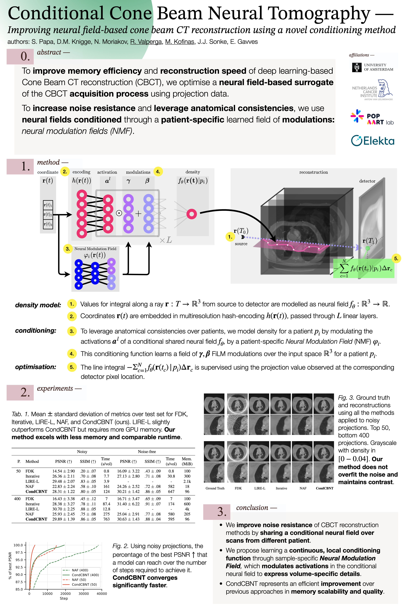

# Neural Fields for Tomographic Reconstruction

_Samuele Papa, David M. Knigge, Riccardo Valperga, Miltiadis Kofina, Nikita Moriakov, Jan-Jakob Sonke, Efstratios Gavves_



In this project we improve neural field methods to quickly perform tomographic reconstruction.
Special care has been put in making realistic assumptions and applying the method to a large open-source dataset.

## Installation
The easiest way to run the code is to create a *conda* environment and install the dependencies from the *environment.yml* file.
```bash
conda env create -f environment.yml
```

This will create a new environment called *tomorecon*.

After the creation of this environment a custom package provided with this repository must be installed to process the geometry files
used to interpret the projections correctly.
Use the following to perform the installation (the `-e` option is used to install the package in *editable* mode):

```bash
conda activate tomorecon
cd tomo_utils_package
pip install -e .
```

## Experiments
Before running any experiment using the conditioning method, use the following to setup the data in the correct format:

```bash
python data_factory/make_recon_data.py --volumes_dir=path_to_original_volumes --recons_dir=path_to_recon_volumes
```

To reproduce the training of the model used in this paper, use the following command:

```bash
python experiments/train_validate.py run_name=train project_name=reproduce dataset.path=path_to_recon_volumes dataset.original_volumes_path=path_to_original_volumes val_dataset.path=path_to_original_volumes dataset.name=reconstructions val_dataset.name=projection nef.type=Hash nef.num_hidden=128 nef.num_layers=2 nef.final_act=relu training.lr=5e-05 nef.conditioning.spatial_cfg.type=Hash nef.conditioning.spatial_cfg.num_layers=2 nef.conditioning.spatial_cfg.num_hidden=128 training.max_time=3600000000 dataset.num_vols=200 hydra.run.dir=path_to_output
```
